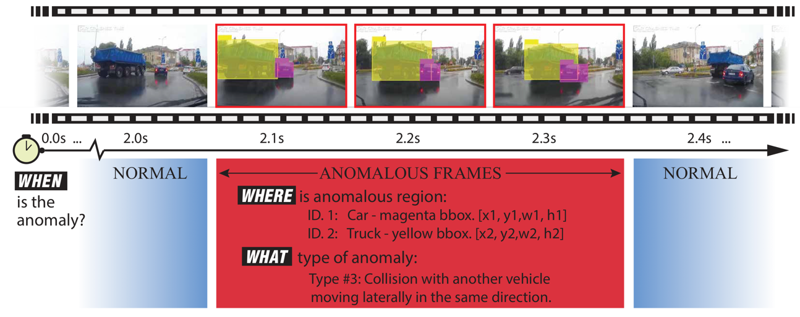

-> Number of entire video sequences - 4,677 videos with temporal, spatial, and categorical annotations \
-> Sampling frequency - Original 30 fps, but extracted frames are at 10 fps in the dataset. Resampling data @ 5 fps to stay consistent with ORBIS \
-> Resolution of frames - 1280 x 720 \
-> Sample gifs which are being used for analysis can be found [here](https://drive.google.com/drive/folders/1hQK9_jdduxfz3JqFivd7eLjolUWyxjWK?usp=share_link)

-> Data Preprocessing - Captured non-OOD data from the first frames (5 sub-sampled) of each sequence, and the anamolous data from the first few frames (5 subsampled) of OOD data. Ignored if the length of anamoly is shorter than the required number of frames. For non-OOD samples, we sampled from the last non-anamolous frames of the sequence if the beginning of the video frames doesn't have enough number of required frames. \
-> Number of Valid datapoints collected after data preprocessing - 4572 (non-OOD) + 4577 (OOD) \
-> 80:20 split for train:val 
